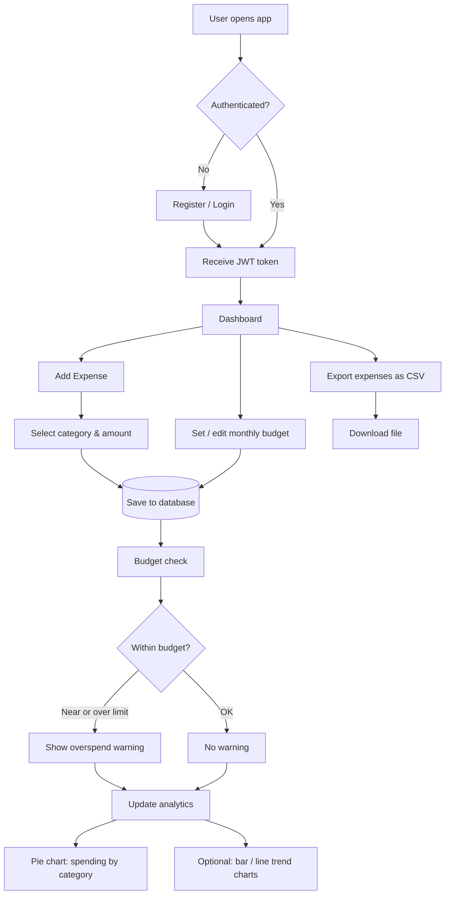

# Student Expense Tracker with Analytics

**Implementation Plan & Workflow**

| Field | Value |
|---|---|
| **Course** | SWE 4637 |
| **Team** | Team 17 |
| **Document Type** | Implementation Plan & Workflow |
| **Estimated Build Window** | ~12 hours (single-day sprint) |

---

## Table of Contents

1. [Overview](#overview)
2. [User Stories](#user-stories)
3. [Application Workflow](#application-workflow)
4. [Implementation Timeline](#implementation-timeline)
5. [Technology Stack](#technology-stack)
6. [Demo Checklist](#demo-checklist)

---

## Overview

This document defines the implementation plan and end-to-end workflow for a **Student Expense Tracker with Analytics** application. The system enables university students to log daily spending, categorize expenses, set monthly budgets, receive overspend warnings, and visualize spending patterns through an analytics dashboard.

The plan is structured as a single ordered checklist intended to be executed top to bottom within a focused build day.

---

## User Stories

User stories describe what the application must deliver from the perspective of a real student using the product — without technical implementation detail.

### User Story 1: Tracking Daily Spending

> **As a** university student,  
> **I want to** log every expense I make (such as food, transport, or books) under a category,  
> **So that** at the end of the month I can clearly see where my money went instead of wondering why I'm broke.

**Acceptance criteria (implied):**

- Users can create, view, update, and delete expense records.
- Each expense is assigned to a category.
- Expense history is persisted and retrievable per user.

---

### User Story 2: Staying Within Budget

> **As a** student living on a fixed monthly allowance,  
> **I want to** set a spending limit for categories like *Food* or *Entertainment* and get warned when I'm about to cross it,  
> **So that** I don't run out of money before the month ends.

**Acceptance criteria (implied):**

- Users can define a monthly budget per category.
- The system compares total spending against the configured limit.
- The UI and API surface a warning when spending is close to or exceeds the budget.

---

## Application Workflow

The diagram below illustrates the journey of a single expense — from user authentication through budget evaluation to analytics visualization.

### Workflow Summary

| Stage | Description |
|---|---|
| **Authentication** | Users register or log in; the backend issues a JWT for protected routes. |
| **Expense capture** | Logged-in users record expenses with category, amount, and date. |
| **Budget evaluation** | After each expense (or on read), spending is compared to the category's monthly budget. |
| **Alerts** | API and UI return or display a warning flag when a budget threshold is reached or exceeded. |
| **Analytics** | Aggregated totals by category and month drive dashboard charts. |
| **Export (optional)** | Users can download expense data as CSV for offline review. |

---

## Implementation Timeline

Times assume a **12-hour build day starting at 9:00 AM**. Adjust clock times proportionally if the session starts later.

### Step 1: Project Setup  
**9:00 – 9:30 AM**

- [ ] Create the GitHub repository and folder structure (`backend/` and `frontend/`)
- [ ] Install required tools: Python, Node.js, PostgreSQL
- [ ] Create the database and confirm connectivity

---

### Step 2: Database Design  
**9:30 – 10:30 AM**

- [ ] Create four core tables: `users`, `categories`, `expenses`, `budgets`
- [ ] Define SQLAlchemy models matching the schema
- [ ] Run the first Alembic migration and verify tables are created

---

### Step 3: User Authentication  
**10:30 – 11:30 AM**

- [ ] Implement register and login API endpoints
- [ ] Hash passwords securely and issue JWT tokens on login
- [ ] Validate login/register flows with Postman or Thunder Client

---

### Step 4: Expense Management (Backend)  
**11:30 AM – 1:00 PM**

- [ ] Build CRUD APIs for expenses
- [ ] Build CRUD APIs for categories
- [ ] Protect routes so only authenticated users can access them

**1:00 – 1:45 PM — Lunch break**

---

### Step 5: Budget & Alert Logic  
**1:45 – 3:00 PM**

- [ ] Build API to set a monthly budget per category
- [ ] Compare total spending against the budget limit
- [ ] Return a warning flag in the API response when a budget is near or over the limit

---

### Step 6: Frontend Foundation  
**3:00 – 4:30 PM**

- [ ] Initialize the React app with Tailwind CSS
- [ ] Build Login and Register pages wired to the backend
- [ ] Implement the basic Dashboard layout and navigation

---

### Step 7: Expense & Budget Screens  
**4:30 – 6:00 PM**

- [ ] Build the **Add Expense** form and expense list view
- [ ] Build the **Set Budget** form and surface overspend warnings in the UI
- [ ] Connect all forms and lists to backend APIs

---

### Step 8: Analytics Dashboard  
**6:00 – 7:30 PM**

- [ ] Add an API endpoint returning totals grouped by category and by month
- [ ] Implement a **pie chart** (spending by category) using Recharts — **priority chart**
- [ ] If time allows, add bar and line charts for spending trends over time

---

### Step 9: CSV Export *(Optional)*  
**7:30 – 8:00 PM**

- [ ] Build a backend endpoint that returns expenses as a downloadable CSV file
- [ ] Add an **Export** button on the frontend

---

### Step 10: Testing & Bug Fixing  
**8:00 – 8:45 PM**

- [ ] Walk through the full user journey: register ? log in ? add expense ? set budget ? view charts
- [ ] Fix errors, broken links, and crashes discovered during testing

---

### Step 11: Final Check & Demo Prep  
**8:45 – 9:00 PM**

- [ ] Seed sample expenses so the demo looks populated
- [ ] Perform a final end-to-end run-through before presenting

---

## Technology Stack

| Layer | Technology |
|---|---|
| **Backend** | Python, SQLAlchemy, Alembic |
| **Database** | PostgreSQL |
| **Authentication** | JWT, secure password hashing |
| **Frontend** | React, Tailwind CSS |
| **Charts** | Recharts (pie chart required; bar/line optional) |
| **API testing** | Postman or Thunder Client |
| **Version control** | GitHub |

### Data Model (Core Entities)

| Table | Purpose |
|---|---|
| `users` | Account credentials and profile data |
| `categories` | Expense groupings (e.g., Food, Transport, Books) |
| `expenses` | Individual spending records linked to users and categories |
| `budgets` | Monthly spending limits per user and category |

---

## Demo Checklist

Use this list for the final validation pass before presentation.

- [ ] New user can register successfully
- [ ] Existing user can log in and receive a valid session/token
- [ ] User can create, view, edit, and delete expenses
- [ ] User can manage categories
- [ ] User can set a monthly budget per category
- [ ] Overspend warning appears when budget threshold is reached
- [ ] Pie chart reflects current spending by category
- [ ] *(Optional)* Bar/line charts show trends over time
- [ ] *(Optional)* CSV export downloads correctly
- [ ] No critical errors during the full demo flow

---

*Team 17 — SWE 4637 — Student Expense Tracker with Analytics*
